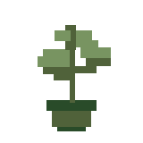
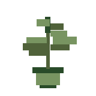
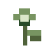
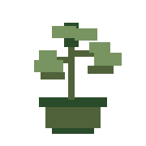
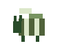
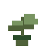
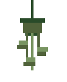

<div align="center">

<br>


&nbsp;&nbsp;&nbsp;&nbsp;


<br><br>


<br>

<h2>building things somewhere between data, code and the real world</h2>

<br>


&nbsp;&nbsp;

&nbsp;&nbsp;


<br><br>

</div>

---

<table>
<tr>
<td width="68%" valign="top">

## hi, I'm Wiktoria

BSc graduate and currently doing my MSc.

I like working with data, building things with code and figuring out what can actually be done with a dataset once you stop treating it like a perfectly behaved tutorial example.

My background is in bioinformatics, but I tend to enjoy the parts where different fields start overlapping rather than staying neatly inside one box.

</td>

<td width="32%" align="center" valign="middle">



<br><br>

<sub>probably another plant</sub>

</td>
</tr>
</table>

---

## what I use

<table>
<tr>
<td width="33%" valign="top">

### languages

`Python`  
`R`  
`SQL`  
`Bash`

</td>

<td width="33%" valign="top">

### data & ML

`Pandas`  
`NumPy`  
`Matplotlib`  
`Scikit-learn`  
`TensorFlow`  
`Librosa`

</td>

<td width="33%" valign="top">

### tools

`Git`  
`GitHub`  
`Jupyter`  
`Linux`

</td>
</tr>
</table>

---

## projects

<table>
<tr>

<td width="50%" valign="top">

### 🐝 Queen Bee Classification

My engineering thesis.

I worked with around **7,100 one-minute audio recordings** from beehives and used machine learning to classify whether a queen bee was present.

```text
audio
 ↓
preprocessing
 ↓
features
 ↓
Mel-spectrograms
 ↓
model
 ↓
classification
```

**Python · TensorFlow · Librosa · Pandas**

[→ repository](https://github.com/YOUR_USERNAME/YOUR_BEE_REPOSITORY)

<br>



</td>

<td width="50%" valign="top">

### 🌱 Soil Moisture Monitor

Current side project.

I have around **40 houseplants**, and apparently trusting myself to notice when they need water is not a sufficiently robust monitoring system.

So I'm building one.

```text
soil
 ↓
sensor
 ↓
measurements
 ↓
storage
 ↓
analysis
```

The goal is to turn *"this plant looks weird"* into actual data.

**Python · sensors · data · visualisation**

[→ repository](https://github.com/YOUR_USERNAME/YOUR_PLANT_REPOSITORY)

<br>



</td>

</tr>
</table>

---

<div align="center">


</div>

## education

**MSc · Bioinformatics**  
currently studying

**BSc · Bioinformatics**  
completed

<br>

<table>
<tr>
<td width="75%" valign="top">

### currently

Working on my Master's and a few projects that happen to sit somewhere around:

`data` · `code` · `biology` · `sensors` · `machine learning` · `databases`

I tend to enjoy projects more when the boundaries between those things start getting blurry.

</td>

<td width="25%" align="center">



</td>
</tr>
</table>

---

<div align="center">

<h2>mostly making things, occasionally breaking them, usually figuring out why</h2>

<br>

<a href="https://www.linkedin.com/in/YOUR_USERNAME/">
  
</a>

<br><br>


&nbsp;&nbsp;&nbsp;

&nbsp;&nbsp;&nbsp;


</div>

<br>

<details>
<summary>you probably shouldn't click this</summary>

<br>

```text
┌──────────────────────────────────────┐
│             SIMS_SAVE.log            │
├──────────────────────────────────────┤
│                                      │
│ household funds ............. 20,000 │
│                                      │
│ financial strategy:                  │
│                                      │
│              motherlode              │
│                                      │
│ objective:                           │
│ let the Sims live the life           │
│ I refuse to fund in real life        │
│                                      │
│ survival probability ........ 100%   │
│ rice + ketchup .............. 0%     │
│                                      │
└──────────────────────────────────────┘
```

</details>
